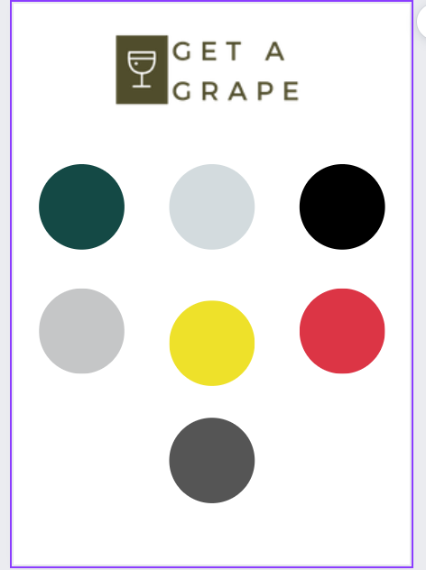
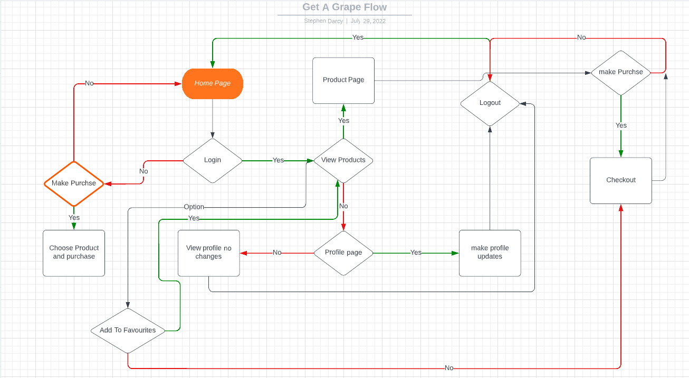

# Get A Grape - Stephen D'Arcy

# Table of contents

1. [Overview](#Overview)
    * [About](#about)
    * [Scope](#Scope)
    * [Agile](#Agile)

2. [Business Model](#Business-Model)

3. [Marketing](#Marketing)

4. [Database](#Database)
   
5. [User Experience](#UserExperience)
    * [Project Goals](#Project-goals)
    * [User Stories](#Userstories)

6. [Features](#Features)

7. [FlowChart Data Structure](#Flow-chart-and-data-structure)

8. [WireFrames](#Wireframes)

9. [Technology Used In Design](#Technology-Used-In-Design)

10. [Testing](#Testing)

11. [Deployment](#Deployment)

12. [Credits](#Credits)

13. [Issues](#Issues)

# Get A Grape Wine store

## Overview

### About
* This was a full stack project based around a fictional e-commerce wine store. The store stocks and sells all manner of wines , Champagne and sparkling
wines from around the world. This the final project in a five project series for my Diploma in full stack we development.

### Scope

* The initial scope of the project is to develop a website where users can register if they like and login to have a profile available to them. The user was not required to register and can still purchase items without a registration process. I believe this is important as it would take away from the user experience if forced to sign up.

* The structure of the website is simple and intuitive with standout call to action buttons for each step of the user experience.

## Agile

The functionality and design process was managed in Github and Github projects and issues.

There were no specific sprints as my workload and family dictated how much time I could dedicate on a weekly basis to the design of the website. But in saying that I have outlined a timeline of the design events below and what order they were carried out.

### Sprint 1:

* Install Django
* Install AllAuth
* Created the project folder
Created the templates folder for allauth , base.html and the includes folder.
* Started README file

### Sprint 2:

* Create the products app
* Create the category and products fixture JSON files nad load them
* Create the models, views and templates for the products app.

### Sprint 3:

* Add bag app
* Add models, views and template for bag app

### Sprint 4:

* Test first deployment in Heroku
* Add new apps checkout and profiles
* Add models, views and templates as required
* Tested Stripe transactions

### Sprint 4:

* Add contact app
* Deployed site to test
* Checked and tested all images to AWS

### User Stories

### EPIC 1 - Basic Web Functionality

* As a shopper/user I can receive alerts/messages so that I can can clearly see what I have added to my bag and what I may have removed.
* As a shopper I can easily contact the site owners by several means so that I can ask advise on orders etc.
* As a shopper I can click on links for social media so that I can contact the site owners in more ways than by email.
* As a user I can view the home page and clearly understand the purpose of the website so that I can navigate through products and search products.
* As a User of the website I can view the site on smaller screens so that I can use the app on mobile devices.
* As a user of the web app I can navigate around the website so that I can view all relevant pages.

### EPIC 2 - User Registration

* As a shopper I can easily login and logout of the website so that I can view and update orders.
* As a shopper I can easily view my profile page so that I can update my current information.
* As a new shopper I can register for a new account so that I can browse and order products.
* As a site user I want to be able to setup new passwords and recover my passwords so that I can get access to my account.

### EPIC 3 - Products

* As a shopper I can add/delete products in my basket so that I can purchase/not purchase the products.
* As a shopper I can easily view product price, rating etc. so that I can decide to buy or not.
* As a shopper I can use the search box so that I can search for all products I am looking for.

### EPIC 4 - Orders

* As a shopper I can pay for my orders with secure transactions so that I can receive goods.
* As a shopper I will receive email conformation of my order so that I can be confident the order was received.
* As a shopper I can see my order details in my profile so that I can see that I have ordered the correct items.
* As a shopper I can view the contents of my bag and see my total so that I can decide to buy or not.

### EPIC 5 - Admin Functions

* As an Admin I can update/delete and edit products so that I can have the most up to date website for my users.
* As a admin I can login to the backend so that I can control and update user details.

### EPIC 6 - Product Views

* As a shopper I can view all products available so that I can decide which to purchase.

# Business Model

- This is a standard B2C application modeled on an e commerce store. The idea is it is easy to access and use for the shopper.

- We offer several different varieties of White, Red wines , Champagne and Rose.

# Marketing

- The website/store has a dedicated Facebook page(Removed by Facebook)

- We offer a mailchimp subscription service to keep members up to date on all or any offers.
- SEO is done through keywords added to the meta tags in the html code. These key words were used in Google to gather the top results as displayed at time of testing.

# Database

The Database diagram can be found [here](docs/gag.db.pdf.pdf)

# Features

## Home Page

* The homepage is a simple design with visible navbar links for all products as well as a breakdown of each product category. We also have a visible call to action button for the user to start shopping. The Account dropdown and shopping back icons are clearly visible. There is a scrolling banner with any special offers available and an intuitive search box for the user to search the website.

## Products Page

* The site user can view all products from this page or click into individual products to see a more detailed description and decide if they would like to make the purchase or
go back to all products.

 

### Bag

* The user can view the contents of their bag and decide to make the purchase or adjust the contents.

### Login Page

* The user can login from here.

### Sign up Page

* The user can sign up for the site here.

### Contact Page

* The user can contact the site owners

# Colors

* The inspiration for the colors used on the website where taken from [Canva](https://www.canva.com/)

#### [Back to content](#table-of-contents)

# FlowChart Data Structure

* Website flowchart

#### [Back to content](#table-of-contents)

## Wireframes

* All wireframes can be found [here](docs/pro_5_wireframes.pdf)

#### [Back to content](#table-of-contents)

# Technology-Used-In-Design

* Django framework
* HTML5
* CSS3
* JQuery
* Javascript
    - Used to implement the change in year on in the copyright section of the footer.
    - Also used to hid the field for the author name in the add post section, if this was visible the ID would appear and cause issues.
    - Used to remove the alert from the screens.
* Python
    - Used in conjunction with the Django framework to implement the website.
* Heroku
    - Use to deploy the project on to the live site.

# Frameworks

* [Django](https://docs.djangoproject.com/en/4.0/)
    - Used to create the URLS, Views, Forms and models in the site. Also uses the Django Template Language within the HTML files.
* [Bootstrap](https://getbootstrap.com/)
    - Bootstrap is mainly used to style the page and add responsiveness to the website.
* [AWS Amazon](https://aws.amazon.com/)
    - AWS S3 buckets is used to store all the images used withing the project.
* [Google Fonts](https://fonts.google.com/)
    - Used as the main fonts throughout the project.
* [Git](https://git-scm.com/)
    - Git is used for version control
* [Github](https://github.com/)
    - Github is being used to write the code and store the project as a whole.
* [Am I responsive](http://ami.responsivedesign.is/)
    - Used to display the main image in the README file.
* [Font Awesome](https://fontawesome.com/)
    - Font awesome is used for the like and dislike icons.
* [All Auth](https://django-allauth.readthedocs.io/en/latest/)
    - All Auth used for authentication od website.
* [PostGres](https://www.postgresql.org/download/)
    - Database used through heroku.
* [SQLite](https://django-allauth.readthedocs.io/en/latest/)
    - https://www.sqlite.com/index.html
* [SmartDraw](https://django-allauth.readthedocs.io/en/latest/)
    - To draw out the database schema.
* [Balsamiq](https://django-allauth.readthedocs.io/en/latest/)
    - To create the wireframes.
* [Stripe](https://stripe.com/ie)
    - To make dummy transaction with dummy credit card.
* [Pillow](https://python-pillow.org/)
    - Python imaging library   

## Requirements file
* asgiref==3.5.2
* boto3==1.24.28
* botocore==1.27.28
* dj-database-url==0.5.0
* Django==3.2
* django-allauth==0.41.0
* django-countries==7.2.1
* django-crispy-forms==1.14.0
* django-storages==1.12.3
* gunicorn==20.1.0
* jmespath==1.0.1
* oauthlib==3.2.0
* Pillow==9.1.1
* psycopg2-binary==2.9.3
* python3-openid==3.2.0
* pytz==2022.1
* requests-oauthlib==1.3.1
* s3transfer==0.6.0
* sqlparse==0.4.2
* stripe==3.5.0

# Testing

## Python Validations
  ### Bag
- [Apps](docs/validation/python/bag/apps.PNG "apps")
- [Contexts](docs/validation/python/bag/contexts.PNG "contexts")
- [Urls](docs/validation/python/bag/urls.PNG "urls")
- [Views](docs/validation/python/bag/views.PNG "views")

### Checkout
- [Apps](docs/validation/python/checkout/apps.PNG "apps")
- [Admin](docs/validation/python/checkout/admin.PNG "admin")
- [Forms](docs/validation/python/checkout/forms.PNG "forms")
- [Urls](docs/validation/python/checkout/urls.PNG "urls")
- [Views](docs/validation/python/checkout/views.PNG "views")
- [Forms](docs/validation/python/checkout/forms.PNG "forms")
- [Webhook](docs/validation/python/checkout/webhooks.PNG "webhook")
- [Webhook Handlers](docs/validation/python/checkout/webhooks_hand.PNG "webhook")
- [Signals](docs/validation/python/checkout/signals.PNG "signals")
- [Models](docs/validation/python/checkout/models.PNG "models")

### Home
- [Apps](docs/validation/python/home/apps.PNG "apps")
- [Urls](docs/validation/python/home/urls.PNG "urls")
- [Views](docs/validation/python/home/views.PNG "views")

### Main

- [ASGI](docs/validation/python/main/asgi.PNG "asgi")
- [Settings](docs/validation/python/main/settings.PNG "settings")
- [WSGI](docs/validation/python/main/wsgi.PNG "wsgi")
- [Urls](docs/validation/python/main/urls.PNG "urls")
- [Views](docs/validation/python/main/views.PNG "views")

### Products

- [Widgets](docs/validation/python/products/apps.PNG "widgets")
- [Admin](docs/validation/python/products/admin.PNG "admin")
- [Forms](docs/validation/python/products/forms.PNG "forms")
- [Models](docs/validation/python/products/models.PNG "models")
- [Urls](docs/validation/python/products/urls.PNG "urls")
- [Views](docs/validation/python/products/views.PNG "views")

### Profiles

- [Forms](docs/validation/python/profiles/forms.PNG "forms")
- [Models](docs/validation/python/profiles/models.PNG "models")
- [Urls](docs/validation/python/profiles/urls.PNG "urls")
- [Views](docs/validation/python/profiles/views.PNG "views")

### Javascript Validations

- [Country Fields](docs/validation/javascript/country_fields.PNG "country")
- [Stripe Elements](docs/validation/javascript/stripe_elements.PNG "stripe")

### HTML Validations

- [Home](docs/validation/html/home_val.PNG "home")
- [Products](docs/validation/html/products_val.PNG "products")
- [Bag](docs/validation/html/home_val.PNG "bag")
- [Privacy](docs/validation/html/home_val.PNG "privacy")
- [Product Management](docs/validation/html/home_val.PNG "management")
- [Shipping](docs/validation/html/home_val.PNG "shipping")
- [Profiles](docs/validation/html/home_val.PNG "profiles")
- [FAQ](docs/validation/html/home_val.PNG "faq")
- [Checkout](docs/validation/html/home_val.PNG "checkout")
- [Logout](docs/validation/html/home_val.PNG "logout")

### CSS Validation

- [Base](docs/validation/html/home_val.PNG "home")
- [Checkout](docs/validation/html/home_val.PNG "home")
- [Product](docs/validation/html/home_val.PNG "home")
- [Profile](docs/validation/html/home_val.PNG "home")

### Automated testing

* I attempted some automated testing but due to time constraints caused by myself (I gave myself one week less as a family holiday was booked) I was not able to include them to a satisfactory level.

#### [Back to content](#table-of-contents)

# Deployment

The live deployed application can be found here 

### Gitpod and GitHub

To use the terminal designed by The Code Institute I used the [Code Institute Full Template](https://github.com/Code-Institute-Org/gitpod-full-template).
This allows the code that is used to run the terminal be viewed in the browser.

### Steps:

* Click create new repository.
* Give the repository a name.
* Under Repository template pick the [Code Institute Full Template](https://github.com/Code-Institute-Org/gitpod-full-template).
* Click create repository
- Use GIT ADD .
- GIT COMMIT -m "Comments"
- GIT PUSH
- To commit the code and push to Github

## Forking the Github Repository

- Locate the desired Github repository.
- In the top right corner click the Fork button.
- The repository has been forked and you can now work 0on the copy.

## Cloning a Github repository

- Locate the desired Github repository.
- Use the code button and copy the link.
- Open Gitpod and select your directory where you want the clone to be created.
- Type git clone in the terminal and paste the link in.
- The clone will be created

### Creating an Application with Heroku

I used the video tutorial provided by The Code Institute to create a Heroku account, add the details of the app and deploy the application to a live environment.

- Log in to Heroku [Heroku](https://dashboard.heroku.com/)
- Click New 
- Give the app a name and choose the region
- Click on settings first and set the Reveal Config Vars
- Click Deploy at the top to go to the Deployment settings
- Choose GiHub as the deployment method
- Search for your app and connect
- Use Automatic deploys if you would like a new build when changes are pushed to GitHub from Gitpod
- Use Manual deploy for a new build every time this button is clicked.
- Once completed click View App

### Updated as Heroku had a security breach and deployment was needed to be completed from the Github CLI.

* Deploying your app to heroku
1. Login to heroku and enter your details.
command: heroku login -i
2. Get your app name from heroku.
command: heroku apps
3. Set the heroku remote. (Replace <app_name> with your actual app name)
command: heroku git:remote -a <app_name>
4. Add, commit and push to github
command: git add . && git commit -m "Deploy to Heroku via CLI"
5. Push to both github and heroku
command: git push origin main
command: git push heroku main

* MFA/2FA enabled?
1. Click on Account Settings (under the avatar menu)
2. Scroll down to the API Key section and click Reveal. Copy the key.
3. Enter the command: heroku_config , and enter your api key you copied when prompted
4. Complete the steps above, if you see an input box at the top middle of the editor...
 a. enter your heroku username
 b. enter the api key you just copied

#### [Back to content](#table-of-contents)

# Credits

### Images

- Site images were taken from https://www.pexels.com/
- Images for the wine bottles where taken from https://www.totalwine.com/ . Note these images are not for any redistribution and are for educational purposes only.  

### Crispy forms instruction

* https://www.geeksforgeeks.org/styling-django-forms-with-django-crispy-forms/

### Django authentication help

* https://django-allauth.readthedocs.io/en/latest/

### Slack Community

* davidwatters_5P and Daniel_C_5p for their help.
* Matt Bodden_5P on always wanting to help out.

* My Mentor Miguel Martinez for his support through the whole process.

* The Slack community as a whole for being awesome.

#### [Back to content](#table-of-contents)

# Issues/Bugs

## Closed Bugs

1. When searching for items the returned images were not displaying correctly in the browser window.
2. When making a payment the stripe webhooks were failing.
3. The footer was not staying at the bottom of the page when the bag empty page was showing.
4. The Stripe overlay was not showing on the completion of a purchase.

* All items above have been addressed and are working as expected.

## Open Bugs

1. The user profile page doesn't appear when clicked in mobile view.
2. The logo I have designed and that can be seen in the Facebook mock ups is not showing on the live website.

#### [Back to content](#table-of-contents)